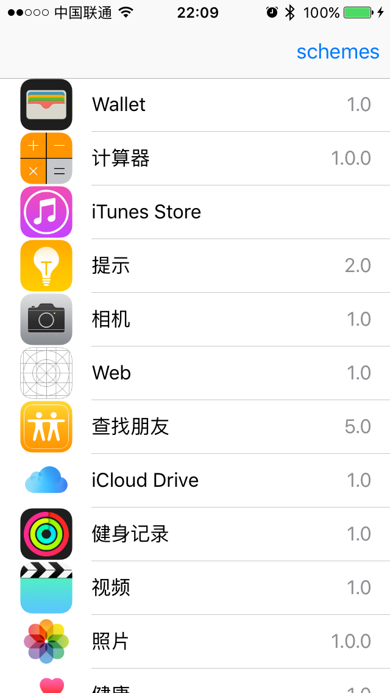
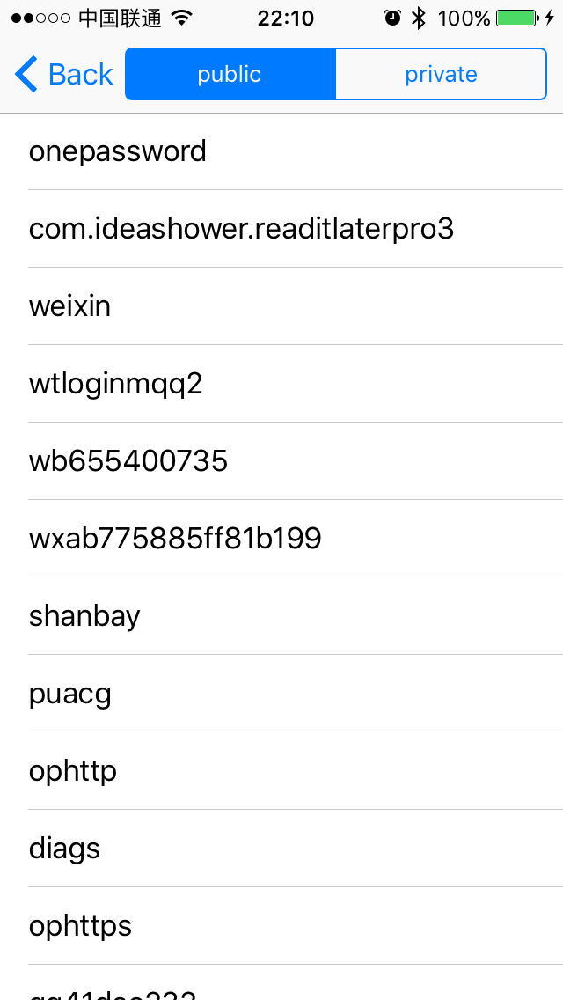
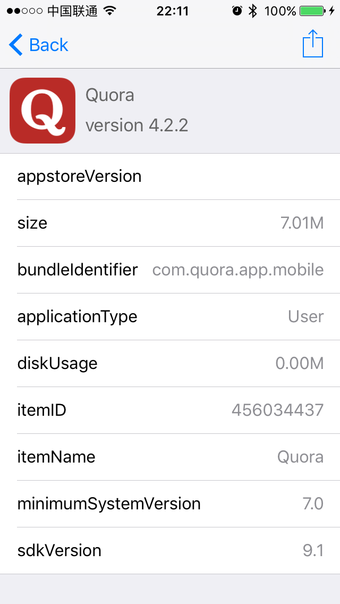
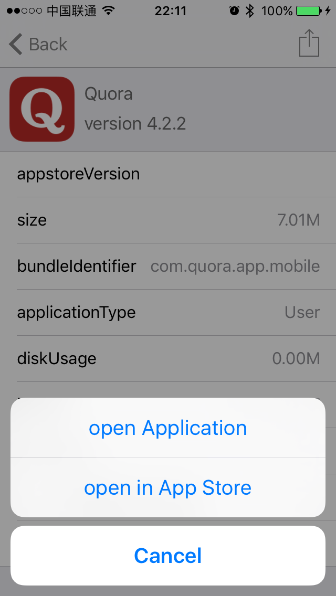

iOSAppsInfo
---------

This is an Application which using ios private api to list all the installed Applications and their details, including:
* localizedShortName
* localizedName
* bundleIdentifier
* applicationIdentifier
* applicationType
* dynamicDiskUsage
* groupIdentifiers
* itemID
* itemName
* minimumSystemVersion
* requiredDeviceCapabilities
* sdkVersion
* shortVersionString
* staticDiskUsage
* teamID
* vendorName

and all of these applications can be opened by this app with their bundleIdentifier.

Also, we list all the public and private scheme urls.

References
---------
* <https://github.com/Shmoopi/iOS-System-Services>
* <https://github.com/nst/iOS-Runtime-Headers>

